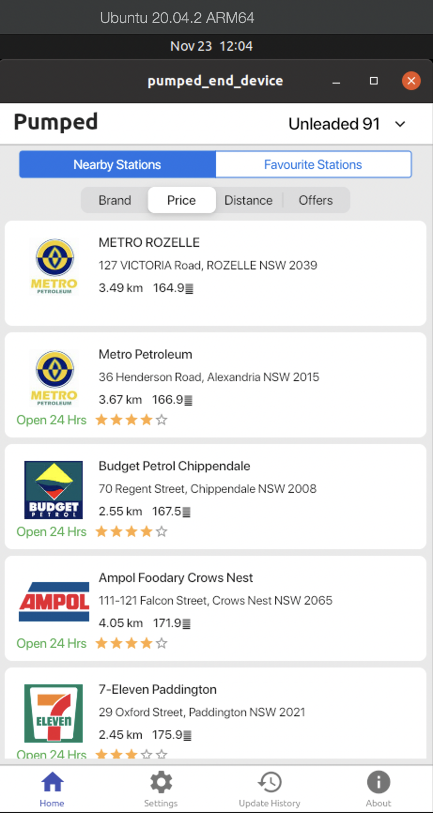

# Pumped End Device (PED) for AGL 
## Table Of Contents
| Title
|:-------------
|<a href="#1-ivi-introduction">1. IVI Introduction</a>
|<a href="#2-hosting-on-web-server">2. Hosting on web server</a>
|<a href="#3-running-on-linux-desktop">3. Running on Linux Desktop</a>
|<a href="#4-running-on-meta-flutter">4. Running on Meta Flutter</a>
|<a href="#5-running-on-toyota-ivi-homescreen">5. Running on Toyota IVI Homescreen</a>
|<a href="#6-deploying-on-agl">6. Deploying on AGL</a>
|<a href="#7-deploying-on-embedded">7. Deploying on Embedded</a>

### 1. IVI Introduction
This branch was created to primarily support In-vehicle infotainment (IVI) as per [Automotive Grade Linux](https://www.automotivelinux.org "Automotive Grade Linux org") and perhpas [Covesa](https://www.covesa.global "Covesa Global") intiailly supporting desktop-linux and web. If you're interest is handhelds primarily android and iOS please switch and review [ped main](https://github.com/bernardpumped/ped "Pumped End Device") branch

### 2. Hosting on web server
* The generated html/javascript files can also be hosted within a web-server eg ngnix. For brevity this Readme will not detail nginx server install.
* `$ flutter build web` command transpiles Flutter/dart to html/javascript into the build/web directory. Copy the contents to a separate directory eg ~/ped-web.
* Adding a new document root to ngnix is done by modifying the ngnix.conf file, the location varies depending upon OS type and installation method. Example - on Mac if ngnix installed using Homebrew, then config file might be located in`/opt/homebrew/etc/nginx/nginx.conf`. On Linux, if installed using yum config might be located in `/etc/nginx/nginx.conf`
* Modify the ngnix.conf file, add the ~/ped-web as additional unique location example
```
location /ped {
  root /home/<user>/ped-web/;
  autoindex on;
} 
```
* Also make sure that all users have read permissions on these files, otherwise ngnix will not serve them over web
```bash
$ chmod a+rwx ~/ped-web
$ cd ~/ped-web
$ chmod a+rwx *
```
* Restart ngnix. Depending on OS, the command varies. Example on Linux it is ```bash $ sudo nginx -s reload ``` on Mac it is 
```bash
$ sudo nginx -s stop
$ sudo nginx 
``` 
* Assuming, host is localhost and ngnix is running on 8080, visit http://localhost:8080/ped/index.html. PED Application works.
* Important considerations
  - On Linux, if there are permissions denied issues accessing above url, then check `/var/log/nginx/error.log`for errors. If there are errors related to permissions or SELinux related issues, then check corresponding chmod commands have been run.
  - If the server is run on local machine at an HTTP endpoint, then there are no issues while accessing the location, to non-HTTPS urls. However, if the server is not a local machine, then for security reasons, browsers do not allow access to location. To circumvent, purchase an SSL certificate OR create a self signed certificate, and configure ngnix to use it. Firefox allows HTTPs URLs using self signed certificates to access location, whilst Chrome/Edge and Safari do not.  
    ```bash
     $ cd /usr/local/share/homescreen
     $ sudo rm -rf bundle
     $ sudo ln -sf ~/development/ped/build/ bundle
    ```
  - Running on Desktop
    * Copy a current icudtl.dat to /usr/local/share/flutter. One can be found in local Flutter installation
      ```bash
       $ sudo mkdir -p /usr/local/share/flutter
       $ sudo cp ~/snap/flutter/common/flutter/bin/cache/artifacts/engine/linux-x64/icudtl.dat /usr/local/share/flutter/
      ```
    * Building Toyota IVI Homescreen generated libflutter_engine.so. Copy it to /usr/local/lib. You can also use LD_LIBRARY_PATH to point downloaded engine for build
    ```bash
      $ sudo cp ~/development/ivi-homescreen/build/libflutter_engine.so /usr/local/lib
    ```
    * Running
    ```bash
     $ cd ~/development/ivi-homescreen/build
     $ export LD_LIBRARY_PATH=`pwd`:$LD_LIBRARY_PATH
     $ homescreen

### 3. Running on Linux Desktop
The Linux distro adopted Ubuntu-20.04.x, which can be standalone or virtualized using Parallels / VirtualBox etc, and in our case using Macs we virtualized using Parallels.
* Install Flutter on linux following the process detailed in [installation link]( https://flutter.dev/docs/get-started/install/linux)
* Flutter Installation
  - Install using snap tool. In Ubuntu-20.04.2 the snap tool was default installed. In case it is not, install following the instruction narrated [here](https://snapcraft.io/docs/installing-snapd)
    - Install flutter using command `$ sudo snap install flutter --classic`
    - Use the following command to display your Flutter SDK path `$ flutter sdk-path`
    - Find the installed location of flutter `$ which flutter`
  - Other option is to install manually, by downloading the latest Flutter installation bundle, for the stable release 
    - ```bash
      $ mkdir ~/development
      $ cd ~/development
      $ tar xf ~/Downloads/flutter_linux_3.x.y-stable.tar.xz
      $ export PATH="$PATH:`pwd`/flutter/bin"
      ```
    - Flutter can be added permanently to the path by modifying the rc file of the default shell. 
  - Run `$ flutter doctor`. which may complain about missing Chrome browser, missing flutter IDE (we did not install Android Studio/VS Code) and no connected devices (we did not install Chrome, Emulator / Simulator). 
  - Current intent is only to build and test Linux platform binary, that is Pumped team who develop on Mac can safely ignore these doctor complaints. This setup does not assume Linux to be development machine. 
  - Building Flutter application on Linux would require additional tools. 
    ```bash 
    $ sudo apt-get install clang cmake ninja-build pkg-config libgtk-3-dev
    ```
  - Enable Linux Support
    ```bash
     $ flutter config --enable-linux-desktop
     $ flutter config --enable-web
     $ flutter channel stable
     $ flutter upgrade
     $ flutter devices
    ```
    Flutter devices should show Linux Desktop as connected device.
 - Building PED on Linux
   - Get PED source code on Linux desktop from Github repository. Assume it is downloaded in ~/development/ped directory
   - Execute following commands
     ```bash
     $ cd  ~/development/ped
     $ flutter create .
     ```
 - Running application on Linux Device
     ```bash
     $ flutter run -d linux
     ```
   <table><tr><td></td><td></td></tr></table>
   - Note:
     - The Location library (geolocator) used in PED does not yet have Linux implementation. Hence, for Linux platform, the lat-long coordinates are hard coded.
  
### 4. Running on Meta Flutter
* In Development

### 5. Running on Toyota IVI Homescreen
**Pending refactoring
* This involves building and installing Toyota IVI Homescreen and then building and installing PED. Here we will be running it on desktop. Caveat when building using Mac 
  This process only works on x86, in conjunction with others, we're investigating what and how to get this working on apple silicon the M1      
  - Build Toyota IVI Homescreen - Refer to [Toyota IVI Homescreen README](https://github.com/toyota-connected/ivi-homescreen/blob/main/README.md) notes
    * Ubuntu-20.04.2 comes with a default installation of Wayland. While logging in, click on gear icon below username and choose *Ubuntu on Wayland* as login option.
    * Download the [Toyota IVI Homescreen code](https://github.com/toyota-connected/ivi-homescreen) . For reference purpose, assume it is in ~/development/ivi-homescreen/
    * Execute following commands, which adds a new update repository and installs set of libraries needed by Toyota IVI
    ```bash
     $ sudo add-apt-repository ppa:kisak/kisak-mesa    
     $ sudo apt-get update -y    
     $ sudo apt-get -y install libwayland-dev wayland-protocols \    
       mesa-common-dev libegl1-mesa-dev libgles2-mesa-dev mesa-utils \
       libxkbcommon-dev
    ```
    * Validate cmake utility is installed by executing command `$ which cmake`. In case it is not installed, execute commands `$ sudo apt install cmake`
    * Validate rpmbuild utility is installed by executing command `$ which rpmbuild`. In case it is not installed, execute command `$ sudo apt-get install rpm`  
    * Build Toyota IVI Homescreen
    ```bash
     $ cd ~/development/ivi-homescreen/
     $ mkdir build && cd build
     $ cmake .. -DCMAKE_STAGING_PREFIX=`pwd`/out/usr/local
     $ make install -j
    ```
    * Create a debian package `$ make package -j`
      - This results in creation of deb package for Linux at path ~/development/ivi-homescreen/build/ivi-homescreen-1.0.0-linux-x86_64.deb
    * Install `$ sudo apt install ./ivi-homescreen-1.0.0-linux-x86_64.deb `
  - Build Pumped End Device
    * Download PED source code from Github. For reference, assume it is in ~/development/ped
    * Flip to Flutter beta channel and enable linux desktop build
    ```bash
     $ flutter channel beta
     $ flutter upgrade
     $ flutter config --enable-linux-desktop
    ```
    
### 6. Deploying on AGL
* In Development

### 7. Deploying on Embedded
* Yet to be defined [Google Flutter Embedded](https://flutter.dev/multi-platform/embedded)
  $ flutter build [ bundle linux web ]

