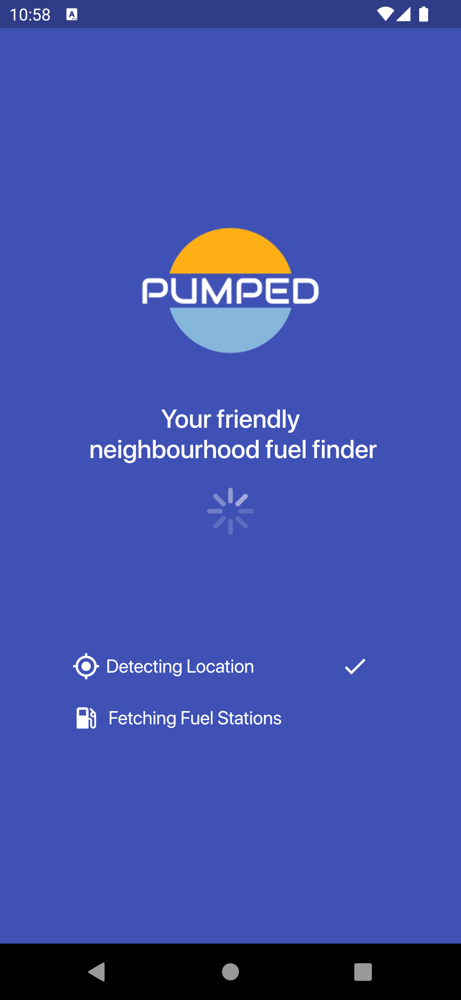
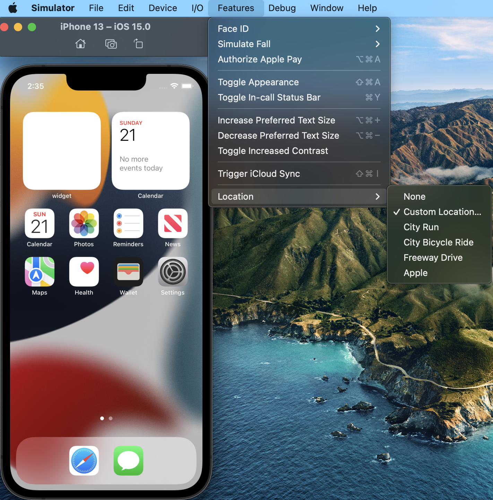
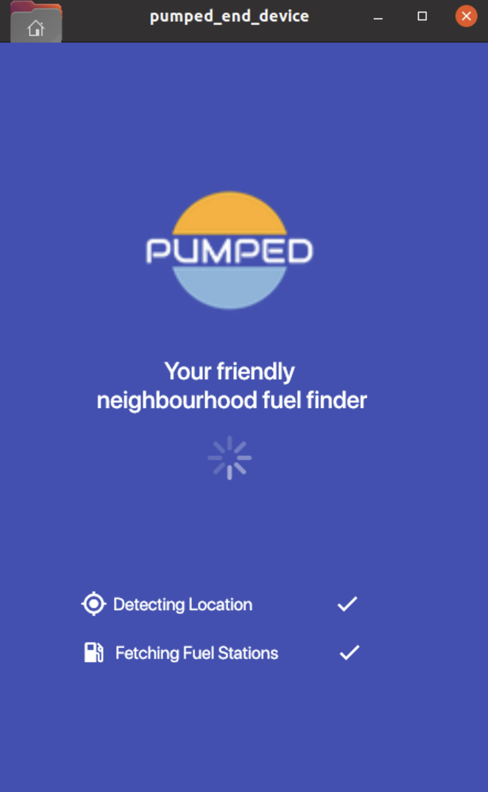

# Pumped End Device
## Table Of Contents
| Title
|:-------------
|<a href="#1-introduction">1. Introduction</a>
|<a href="#2-license">2. License</a>
|<a href="#3-development-environment-setup-and-build-on-mac">3. Development Environment Setup and Build on Mac</a>
|<a href="#4-prerequisite-for-running-ped">4. Prerequisite for running PED</a>
|<a href="#5-running-on-android-emulator">5. Running on Android Emulator</a>
|<a href="#6-running-on-ios-simulator">6. Running on iOS Simulator</a>
|<a href="#7-running-on-local-web">7. Running on Local Web</a>
|<a href="#8-running-on-linux-desktop">8. Running on Linux Desktop</a>
|<a href="#9-running-on-toyota-ivi-homescreen">9. Running on Toyota IVI Homescreen</a>
|<a href="#10-deploying-on-agl">10. Deploying on AGL</a>
|<a href="#11-deploying-on-embedded">11. Deploying on Embedded</a>
|<a href="#12-ped-testability">12. PED Testability</a>
|<a href="#13-faq">13. FAQ</a>

## 1. Introduction
### Background
Pumped is a combination of 3 core projects to connect vehicle drivers with retail merchants, initially starting with fuel stations. Our objective is to offer the best fuel prices, closest stations, friendliest service, cleanest restrooms, tastiest coffee and so much more, direct to vehicle drivers.

Retailers, beat your competition! If you can't compete on fuel price alone, promote your offers and personalised services on Pumped platform and get it delivered directly to your target audience faster and cheaper than any other means possible via Pumped app and 'every other' smartphone fuel app registered as Pumped agents.

### Pumped Projects
**Backend -** Enterprise grade globally scalable web app providing centralized integration for all external parties. Phase-1 Complete and in production. Currently sourcing near real time fuel prices and associated data for >75% of fuel stations throughout Australia. Please note, if you're interested in covering your location - country, state, province, emirate or continent, we’ll be happy to discuss options with you.

**Merchant -** B2B SaaS, Fully integrated retailer driven reactive web app to maintain station details, brand, fuel prices, products, offers and services directly to their target consumer audience. Pumped Merchant will also be open sourced with phase-1 65% complete and due for Merchant client demos 2022 Q3.

**End Device (PED) -**  This project, a Flutter based app, representing the user interface of the above projects. Phase-1 75% complete for Android, iphone and web and will be released to Google Play and App store 2022 Q2. PED,
fetches fuel station data from the pumped backend based upon the user's current location. Data currently includes fuel prices, contact details, features/facilities, ratings, reviews and photos.
And, with the integration of Pumped Merchant in Phase-2 in-store products and garage service promotions. For the purposes of this project and repo the backend is hosted on our integration test server.
As such, prices are not real time but rather, updated weekly. You may also be wondering if we cover EV's. The answer is yes, but only tentatively - we’re very interested in EV's and happy to discuss options with you.

### Audience
Within the following steps you’ll see we’ve gone into considerable detail on the what and how to set up, deploy and run PED upon multiple platforms in an attempt to reach as many people as possible who may be interested in PED but not necessarily app developers. We are specifically interested in the embedded space as it is our long term goal to connect PED within vehicles as part of InVehicle Infotainment (IVI), thus realigning vehicle manufacturers and retail industry domains.

Of course, this is hugely ambitious and impossibly difficult for a burgeoning startup, and we’re initially focused on merchant integration and global scalability. There are many other components that need to be built with a focus on providing reciprocity and partnership between multiple parties including, but not limited to OEM’s, retailer/logistic, payment, app distribution/management and devs/engineers.
We trust you find PED useful and deploy/test to your platform of choice and perhaps contribute a little. We’re here to answer your questions as best we can.

### Investing
If you think perhaps what we’re doing may be of interest to you or your company, we are seeking investment/partnership so please feel free to reach out.

## 2. License
Pumped End Device code base is shared under GNU Public License V3 [](https://opensource.org/licenses/). A copy of the license text is also present in the [COPYING](/COPYING) file. Please read through it thoroughly before using code in any shape/form.

## 3. Development Environment Setup and Build on Mac
Before commencing with any of the following it's highly recommended to remain current with regards to patches as Flutter is evolving quickly with no concept of long term support

### 3.1. Flutter Installation
Download and install Flutter following the steps narrated on [Flutter Website](https://docs.flutter.dev/get-started/install). This readme assumes your operating system is macOS with steps as follows:

* Download flutter (by default downloads into ~/Downloads folder)
* Create directory ~/development and unzip downloaded Flutter into it. It creates a Flutter sub-directory.
```bash
$ mkdir ~/development
$ cd ~/development
$ unzip ~/Downloads/flutter_macos_2.5.3-stable.zip
```
* Add Flutter to the PATH variable
```bash
$ export PATH="$PATH:`pwd`/flutter/bin"
```
* Alternatively, Flutter can be added permanently in the PATH. Typing `echo $SHELL` in your terminal tells you which shell you’re using. If you’re using Bash, edit $HOME/.bash_profile or $HOME/.bashrc. If you’re using Z shell, edit $HOME/.zshrc. If you’re using a different shell, the file path and filename will be different on your machine. Add the following lines in the rc file:
```bash
$ export PATH="$PATH:~/development/flutter/bin"
```
* And then execute source the rc file where you modified the PATH variable.
```bash
$ source ~/.bashrc
```
* Validate that flutter is actually set in the PATH
```bash
$ echo $PATH
$ which flutter
$ which flutter dart
```

### 3.2. Android Studio Setup
Internally we use Android Studio as our IDE for Pumped End Device (PED) Flutter devlopment, which provides many useful features including tools and plugins for executing code on both iOS and Android simulators in addition to physical devices. Other IDEs such as Visual Studio are also commonly used for flutter development.
* Visit [Android Studio Website](https://developer.android.com/studio) to download Android Studio. By default it shows platform specific build to download.
* Drag and drop the downloaded executable in Applications folder as shown so that it easily comes under spotlight search. 
* 1st time launching Android Studio prompts for the installation of multiple dependencies.
* Open SDK Manager [Menu > Preferences > Appearance and Behavior > System Settings > Android SDK]. Refer to the images to validate and install missing SDK Platforms and SDK Tools <table><tr><td></td></tr><tr><td></td></tr></table>
* Note - Android SDK Command-line is important and separately prompts you to accept android licenses. 
* Navigate to Menu > Preferences > Plugins. Install following Android Studio plugins. They provide necessary tools to enable compilation & execution of Flutter application. 

### 3.3. XCode Setup
XCode is only available for Mac and is mandatory when building Flutter apps for macOS and iOS. Therefore, if you're not building for apple you can bypass this section. Xcode provides Simulator application which emulates iOS device.
* Open App Store on Mac and search for XCode. Click on install if not already installed, and note download is large 10gb+ and can take several hours based upon your network bandwidth. If it is already installed it shows "Open" button 
* Configure the Xcode command-line tools to use the newly-installed version of Xcode by running the following from the command line:
```bash
$ sudo xcode-select --switch /Applications/Xcode.app/Contents/Developer
$ sudo xcodebuild -runFirstLaunch
``` 
* Make sure the Xcode license agreement is signed by either opening Xcode once and confirming or running `sudo xcodebuild -license` from the command line.
* Important - we will configure Apple developer account later which is another mandatory requirement when running app on physical iOS device. It is not required when running on iOS Simulator.

### 3.4 Other Tools
* Install Chrome, which will be used in development and testing of web. 
* Execute command `flutter doctor`- which validates your Mac dev host install and setup to ensure building and running Flutter application.
* Output of the command on initial run will be  . It complains of unaccepted android licenses and missing Apple cocoapods.
* Accept licenses by executing command `$ flutter doctor --android-licenses`
* If deploying to iOS, install missing cocoapods by executing command `$ sudo gem install cocoapods`
* you may wish to also install Visual Studio Code, as it is another great IDE for Flutter development.
* Output of the command when everything is setup properly 

### 3.5 PED Code Setup
* Clone PED Github repository on local box. https://github.com/bernardpumped/ped
* Open Android Studio. Click Open. Browse to the downloaded PED repository (~/development/code/ped). Click Open.
* Open command prompt and execute following commands.
```bash
$ cd ~/development/code/ped
$ flutter create . 
or 
$ flutter create --org FLUTTER_APP .
```
* Above command prepares workspace for building of iOS, Android and Web releases. It also pulls the relevant dependencies as mentioned in pubspec.yaml, with successful completion resulting in correct setup of Android Studio workspace. 
#### 3.5.1 Android Build
* Execute `$ flutter build apk --debug` for Android builds. Successful execution will generate apk in path`build/app/outputs/flutter-apk/app-debug.apk`
#### 3.5.2 iOS Build
* Building for iOS requires connecting to Apple Developer account by signing in with Apple ID in Xcode and creating an iOS Development Certificate as well as a Provisioning Profile for project.
* Open the Flutter project's Xcode target with `open ios/Runner.xcworkspace`
* Select the 'Runner' project in the navigator then the 'Runner' target in the project settings
* Make sure a 'Development Team' is selected under Signing & Capabilities > Team. You may need to:
  - Log in with your Apple ID in Xcode first
  - Ensure you have a valid unique Bundle ID
  - Register your device with your Apple Developer Account
  - Let Xcode automatically provision a profile for your app
* Execute `$ flutter build ios --debug` for iOS builds. It results into generation of `build/ios/iphoneos/Runner.app` file.
* Note - In case of M1 Macs build failing with error message `incompatible architecture (have 'arm64', need 'x86_64')` . To fix this execute the command `$ sudo arch -x86_64 gem install ffi`
#### 3.5.3 Web Build
* Execute `$ flutter build web` for web builds. It results into generation of js and html code in directory `build/web/`

## 4. Prerequisite for running PED
* Fuel Station details displayed on PED are served from the Pumped backend server. PED code base open sourced is configured to hit the pre-production server to get this data. Though we maintain high standards, there are sometimes situations when the pre-prod backend server is not up and running, due to activities like maintenance etc. In situations, when PED is launching on the device, but fails to show any fuel stations, there are couple of possibilities 
 - There are no fuel stations in 15km radius around the latitude longitude provided by the device to the pumped server.
 - Pumped pre-production backend server is down for maintenance purpose. Follow these steps to detect it.
  - Execute commands 
    ```bash
    $ ping tst.pumpedsvr.com
    ```
    Successful ping indicates server is up and running.
    ```bash
    $ curl http://tst.pumpedsvr.com:17001/getBackendMetadata
    {"responseCode":"SUCCESS","responseDetails":null,"invalidArguments":{},"responseEpoch":1639741205223,"versionId":"1.0.0.b"}
    ```
    SUCCESS responseCode with versionId indicates that Pumped server is up and running. 
    ```bash
    $ curl "http://tst.pumpedsvr.com:17001/getFuelStationsInRange?lat=-33.865107&lng=151.205282&range=4.763266315977763&unit=kilometre&fuelType=ALL&numResults=20&sortOrder=CHEAPEST_CLOSEST"
    {"responseCode":"SUCCESS","responseDetails":null,"invalidArguments":{},"responseEpoch":1639743414826,"stationFuelQuoteMap":{"20609":[{"id":4843877,"fuelStationId":20609,"fuelType":"E10","fuelMeasure":"litre","quoteValue":189.9,....
    ```
    This produces fairly large response. Here it is trimmed. The responseCode SUCCESS with stationFuelQuoteMap having data data available means that the latitude longitude are covered by Pumped.

## 5. Running on Android Emulator
* Android Studio comes with AVD (Android Virtual Device) Manager which can be used to create Android Virtual Machines.
* Android Studio Menu > Tools > AVD Manager
* Click Create Virtual Device
* Select Hardware > Choose a device definition > Category - Phone > Name - Pixel 5 > Next. ( or other hardware profile as you wish).
* Select System Image > S (API Level 31) > Next. Note - we normally choose latest System Image
* Verify Configuration > AVD Name (Pixel 5 API 31) > Click Show advanced setting, modify the internal storage to 4096 MB. Finish. Review other configurations.
* When done, it presents a list of your Virtual Devices. Click on Action icon (green triangle) to start the virtual device. 
* PED requires access location in order to search nearby. Clicking on the three dots (annotated as 1) will present with device settings, where the location can be set (annotated as 2). Click on the `Send` button (annotated as 3) to forward location to the emulator 
* As narrated within the [Introduction](#1-introduction) section, PED data is currently available throughout Australia only hence, please provide latitude and longitude of places within Australia, except the state of Victoria. Example (-33.865107, 151.205282) Sydney location. Once location has been set you can check emulator received it by opening google maps within the emulator, it should show Sydney CBD Wynyard Station.
* Once the Android Emulator is up and running, Android Studio automatically detects it. Click the Run button (green triangle) to run the application on emulator. 
* On first start, application asks for access to location service, allow "While using the app" <table><tr><td></td><td></td><td></td></tr></table>

## 6. Running on iOS Simulator
* iOS Simulator gets installed with XCode.
* Simulator can be started in two ways - Spotlight Search [Cmd + Space] type Simulator or `$ open -a Simulator`
* Simulator boots with the version of iOS supported by XCode. It can be flipped to other iOS/iPhone versions by navigating through Simulator > File Menu > Open Simulator > iOS > iPhoneXXXX 
* PED requires access to location to be able to search nearby. In Simulator it can be done as Simulator Menu > Features > Location > Custom Location. . 
* It presents dialog box to enter relevant latitude and longitude 
* As narrated within the [Introduction](#1-introduction) section, PED data is currently available throughout Australia only hence, plese provide latitude and longitudes of places within Australia, except the state of Victoria. Example (-33.865107, 151.205282) Sydney location. Once location has been set you can check simulator received it by opening Apple maps within the simulator, it should show Sydney CBD Wynyard Station.
* Once the Simulator is up and running, Android Studio automatically detects it. Click the Run button (green triangle) to run the application on simulator. 
* On first start, application asks for access to location service, allow "While Using the App" <table><tr><td></td><td></td></tr></table>

## 7. Running on Local Web
The command `flutter create .` executed as part of [Code Setup](#35-ped-code-setup) also generates relevant files to enable PED run as web application in either of the following two ways:
### 7.1 Running via Android Studio
* Ensure Location Services under System Preferences > Security & Privacy is enabled on your Mac
* Select the `Chrome (Web)` as the run target and Click the Run button (green triangle). 
* Chrome browser comes up and on start it asks for the location access. 
* Note - Chrome, unlike the Emulator/Simulator, currently does not provide any mechanism to override location. Hence, until such time Google resolve, we've temporaily hard-coded Sydney location when it runs within a browser, and note it is still necessary to permit location service access for PED to function.
* <table><tr><td></td><td></td><td></td></tr></table>

### 7.2 Hosting on a web server
* The generated html/javascript files can also be hosted within a web-server eg ngnix. For brevity this Readme will not detail nginx server install.
* `$ flutter build web` command transpiles Flutter/dart to html/javascript into the build/web directory. Copy the contents to a separate directory eg ~/ped-web.
* Adding a new document root to ngnix is done by modifying the ngnix.conf file, the location varies depending upon OS type and installation method. Example - on Mac if ngnix installed using Homebrew, then config file might be located in`/opt/homebrew/etc/nginx/nginx.conf`. On Linux, if installed using yum config might be located in `/etc/nginx/nginx.conf`
* Modify the ngnix.conf file, add the ~/ped-web as additional unique location example
```
location /ped {
  root /home/<user>/ped-web/;
  autoindex on;
} 
```
* Also make sure that all users have read permissions on these files, otherwise ngnix will not serve them over web
```bash
$ chmod a+rwx ~/ped-web
$ cd ~/ped-web
$ chmod a+rwx *
```
* Restart ngnix. Depending on OS, the command varies. Example on Linux it is ```bash $ sudo nginx -s reload ``` on Mac it is 
```bash
$ sudo nginx -s stop
$ sudo nginx 
``` 
* Assuming, host is localhost and ngnix is running on 8080, visit http://localhost:8080/ped/index.html. PED Application works.
* Important considerations
  - On Linux, if there are permissions denied issues accessing above url, then check `/var/log/nginx/error.log`for errors. If there are errors related to permissions or SELinux related issues, then check corresponding chmod commands have been run.
  - If the server is run on local machine at an HTTP endpoint, then there are no issues while accessing the location, to non-HTTPS urls. However, if the server is not a local machine, then for security reasons, browsers do not allow access to location. To circumvent, purchase an SSL certificate OR create a self signed certificate, and configure ngnix to use it. Firefox allows HTTPs URLs using self signed certificates to access location, whilst Chrome/Edge and Safari do not.  

## 8. Running on Linux Desktop
The Linux distro we adopted is Ubuntu-20.04.x, which can be standalone or virtualized using Parallels / VirtualBox etc, and in our case using Macs we virtualized using Parallels.
* Install Flutter on linux following the process detailed in [installation link]( https://flutter.dev/docs/get-started/install/linux)
* Flutter Installation
  - Install using snap tool. In Ubuntu-20.04.2 the snap tool was default installed. In case it is not, install following the instruction narrated [here](https://snapcraft.io/docs/installing-snapd)
    - Install flutter using command `$ sudo snap install flutter --classic`
    - Use the following command to display your Flutter SDK path `$ flutter sdk-path`
    - Find the installed location of flutter `$ which flutter`
  - Other option is to install manually, by downloading the latest Flutter installation bundle, for the stable release 
    - ```bash
      $ mkdir ~/development
      $ cd ~/development
      $ tar xf ~/Downloads/flutter_linux_2.5.3-stable.tar.xz
      $ export PATH="$PATH:`pwd`/flutter/bin"
      ```
    - Flutter can be added permanently to the path by modifying the rc file of the default shell. 
  - Run `$ flutter doctor`. which may complain about missing Chrome browser, missing flutter IDE (we did not install Android Studio/VS Code) and no connected devices (we did not install Chrome, Emulator / Simulator). 
  - Current intent is only to build and test Linux platform binary, that is Pumped team who develop on Mac can safely ignore these doctor complaints. This setup does not assume Linux to be development machine. 
  - Building Flutter application on Linux would require additional tools. 
    ```bash 
    $ sudo apt-get install clang cmake ninja-build pkg-config libgtk-3-dev
    ```
  - Enable Linux Support
    ```bash
     $ flutter config --enable-linux-desktop
     $ flutter channel beta
     $ flutter upgrade
     $ flutter devices
    ```
    Flutter devices should show Linux Desktop as connected device.
 - Building PED on Linux
   - Get PED source code on Linux desktop from Github repository. Assume it is downloaded in ~/development/ped directory
   - Execute following commands
     ```bash
     $ cd  ~/development/ped
     $ flutter create .
     ```
 - Running application on Linux Device
     ```bash
     $ flutter run -d linux
     ```
   <table><tr><td></td><td></td></tr></table>
   - Note:
     - The Location library (geolocator) used in PED does not yet have Linux implementation. Hence, for Linux platform, the lat-long coordinates are hard coded.
  
## 9. Running on Toyota IVI Homescreen
* This involves building and installing Toyota IVI Homescreen and then building and installing PED. Here we will be running it on desktop. Caveat when building using Mac 
  This process only works on x86, in conjunction with others, we're investigating what and how to get this working on apple silicon the M1      
  - Build Toyota IVI Homescreen - Refer to [Toyota IVI Homescreen README](https://github.com/toyota-connected/ivi-homescreen/blob/main/README.md) notes
    * Ubuntu-20.04.2 comes with a default installation of Wayland. While logging in, click on gear icon below username and choose *Ubuntu on Wayland* as login option.
    * Download the [Toyota IVI Homescreen code](https://github.com/toyota-connected/ivi-homescreen) . For reference purpose, assume it is in ~/development/ivi-homescreen/
    * Execute following commands, which adds a new update repository and installs set of libraries needed by Toyota IVI
    ```bash
     $ sudo add-apt-repository ppa:kisak/kisak-mesa    
     $ sudo apt-get update -y    
     $ sudo apt-get -y install libwayland-dev wayland-protocols \    
       mesa-common-dev libegl1-mesa-dev libgles2-mesa-dev mesa-utils \
       libxkbcommon-dev
    ```
    * Validate cmake utility is installed by executing command `$ which cmake`. In case it is not installed, execute commands `$ sudo apt install cmake`
    * Validate rpmbuild utility is installed by executing command `$ which rpmbuild`. In case it is not installed, execute command `$ sudo apt-get install rpm`  
    * Build Toyota IVI Homescreen
    ```bash
     $ cd ~/development/ivi-homescreen/
     $ mkdir build && cd build
     $ cmake .. -DCMAKE_STAGING_PREFIX=`pwd`/out/usr/local
     $ make install -j
    ```
    * Create a debian package `$ make package -j`
      - This results in creation of deb package for Linux at path ~/development/ivi-homescreen/build/ivi-homescreen-1.0.0-linux-x86_64.deb
    * Install `$ sudo apt install ./ivi-homescreen-1.0.0-linux-x86_64.deb `
  - Build Pumped End Device
    * Download PED source code from Github. For reference, assume it is in ~/development/ped
    * Flip to Flutter beta channel and enable linux desktop build
    ```bash
     $ flutter channel beta
     $ flutter upgrade
     $ flutter config --enable-linux-desktop
    ```
    * Build PED
    ```bash
     $ cd ~/development/ped
     $ flutter create .
     $ flutter build bundle
    ```
  - Install on Toyota IVI Homescreen
    ```bash
     $ cd /usr/local/share/homescreen
     $ sudo rm -rf bundle
     $ sudo ln -sf ~/development/ped/build/ bundle
    ```
  - Running on Desktop
    * Copy a current icudtl.dat to /usr/local/share/flutter. One can be found in local Flutter installation
      ```bash
       $ sudo mkdir -p /usr/local/share/flutter
       $ sudo cp ~/snap/flutter/common/flutter/bin/cache/artifacts/engine/linux-x64/icudtl.dat /usr/local/share/flutter/
      ```
    * Building Toyota IVI Homescreen generated libflutter_engine.so. Copy it to /usr/local/lib. You can also use LD_LIBRARY_PATH to point downloaded engine for build
    ```bash
      $ sudo cp ~/development/ivi-homescreen/build/libflutter_engine.so /usr/local/lib
    ```
    * Running
    ```bash
     $ cd ~/development/ivi-homescreen/build
     $ export LD_LIBRARY_PATH=`pwd`:$LD_LIBRARY_PATH
     $ homescreen
    ```
    
## 10. Deploying on AGL
* Yet to be defined

## 11. Deploying on Embedded
* Yet to be defined [Google Flutter Embedded](https://flutter.dev/multi-platform/embedded)

## 12. PED Testability
Being able to test is the key criteria to build a stable application. PED supports different testing strategies - 
 * **Unit tests** -  Writing plain vanilla flutter test require adding dependency on [flutter_test](https://api.flutter.dev/flutter/flutter_test/flutter_test-library.html) Core Flutter SDK Library under dev_dependencies section in pubspec.yaml. Executing a test file requires executing the *flutter test* command. Example command referring PED test 
   ```bash
   $ flutter test test/data/local/location/geo_location_wrapper_test.dart
   ```
 * **Unit Tests with Mocking** - If the object being tested is dependent on another object, then mockito can be used to mock the dependency and fix dependency behavior. This enables isolation and comprehensive validation of the object under test. In case, if object under test does not have dependency or there is no need to fix the dependency behavior then Mockito is not required. To enable mocking, add [mockito](https://pub.dev/packages/mockito) dependency under dev_dependencies section of pubspec.yaml in addition to flutter_test. To use Mockito's generated mock classes, add a [build_runner](https://pub.dev/packages/build_runner) dependency under dev_dependencies section. Refer test/data/local/location/location_data_source_test.dart file as an example of how Mocks are declared. Annotate the main method with @GenerateMocks annotation and specify the list of classes whose mocks are needed to be generated. In general, these classes would be the dependencies of the class under test. Execute following command to generate the mocks
   ```bash
   $ dart run build_runner build
   ```
   It will generate mocks in a file whose name follows pattern <test_file>.mocks.dart. Referring the example - the file name will be location_data_source_test.mocks.dart. The generated mocks provide methods which can be used to fix the behavior of mock in a particular scenario. Use these mocks to enable isolation of the logic under test. Refer the [pub.dev mockito page](https://pub.dev/packages/mockito) to understand various features provided by mockito.  Command for executing the test remains the same. 
   ```bash
   $ flutter test test/data/local/location/location_data_source_test.dart
   ```
   *Code should follow certain design patterns so that dependencies could be easily mocked. Example - injecting the dependencies at the time of object creation, instead of creating them dynamically when needed. A dependency injection framework [GetIt](https://pub.dev/packages/get_it) is being introduced in PED to enable this, and the code is slowly refactored to use GetIt where ever applicable.*
 * **UI test cases** - The purpose of UI testing is to mimic the behavior and experience of end user. It provides completeness to testing, as this covers testing scenarios which cannot be easily covered with the unit testing. It is an integration testing mechanism for the application. These test run in a separate process and can be done on real devices/simulators/emulators. To enable UI testing Flutter SDK package [flutter_driver](https://api.flutter.dev/flutter/flutter_driver/flutter_driver-library.html) as dependency in dev_dependencies section of pubspec.yaml. General strategy for UI testing is to a) initiate an instrumented version of the app b) run the unit test on the instrumented app c) validate the assertion d) teardown the instrumented app. For brevity, this README.md would not go in all the details of how this is done. In PED code base, the UI instrumented tests are present in test_driver folder. Command to execute the tests is 
```bash
$ flutter driver --target test_driver/main.dart
```
This command needs a device to launch an instrumented version of app, so before executing this command, bring up either Simulator/Emulator or attach a physical device (compatible of running flutter app). Also, make sure that the location which is used by the device belongs to a place, supported by Pumped, else the application will fail fetching the fuel stations from backend.

## 13. FAQ
   
**Q: how to set my location**

 If you currently reside outside of Australia then you need to fake an Australian place for PED to work. PED has fuel station  prices throughout Australia except within the state of VIC .
Therefore, when using physical device Android or iPhone you can fake a location using one of the many fake GPS apps available on Google Play and App store
When using virtual device emulator or simulator you can fake your location within those aps
When using web you can fake your location as per your particular browser settings, and to ensure PED covers as many browsers as possible we fake the location kIsWeb within LocationDataSource to Sydney Fishburners https://fishburners.org/ Pumped Fuel Home.
As of today flutter library implementation of linux desktop location is not working therefore we again fake the location to Sydney Fishburners, and within places.dart we've setup various other locations within Australia

**Q: No version of NDK matched the requested version nn.n.vvvvvvv. Versions available locally: nn.n.nnnnnnn?**

After a recent flutter upgrade android builds started failing with this NDK mis-match error, the issue appears to be gradle related of which there are various ways to resolve dependant upon your setup
https://stackoverflow.com/questions/60404457/no-version-of-ndk-matched-the-requested-version. As PED is not (yet) using NDK we simply choose to uninstall it sdkmanager --uninstall 'ndk-bundle'